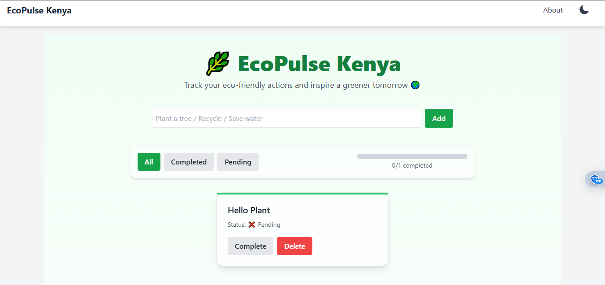

Just replace your current README.md with this content ⬇️

# 🪴 EcoPulse Kenya  

**EcoPulse Kenya** is a responsive React application designed to track eco-friendly actions and encourage sustainable habits.  
Users can log activities like planting trees, recycling, or conserving water — while tracking their progress, earning badges, and discovering daily eco-tips.

---

## ✨ Features

- 🌱 **Track Green Actions:** Add, complete, and delete eco-tasks.  
- 🔎 **Task Filters:** View *All*, *Completed*, or *Pending* tasks.  
- 📊 **Progress Bar:** Visualize your completion percentage.  
- 💾 **Persistent Storage:** Tasks are saved in browser **localStorage**.  
- 💡 **Eco Tips:** Daily sustainability tips fetched from an API.  
- 🌗 **Dark/Light Mode:** Toggle seamlessly between themes.  
- 🏆 **Gamification Badges:**
  - 1+ tasks → *Eco Starter*  
  - 5+ tasks → *Eco Hero*  
  - 10+ tasks → *Eco Champion*  
- 📱 **Responsive Design:** Optimized for mobile, tablet, and desktop.  
- 🎞️ **Smooth Animations:** Subtle task transitions and toast notifications.

---

## 🎨 Screenshots

🛠️ Technologies Used
Category	Tools / Libraries
Frontend	React.js, JSX, Tailwind CSS
Routing	React Router
State Management	React Hooks (useState, useEffect, useContext)
Persistence	Custom useLocalStorage Hook
Animations	Framer Motion + Tailwind CSS transitions
API	Local API simulation for eco tips
Build Tool	Vite.js
Deployment	Vercel
⚙️ Setup Instructions
1️⃣ Clone the Repository
git clone https://github.com/MwandikiAntony/ecopulse-kenya.git
cd ecopulse-kenya

2️⃣ Install Dependencies
npm install

3️⃣ Run the Development Server
npm run dev

Open http://localhost:5173
 in your browser.

4️⃣ Build for Production
npm run build

5️⃣ Deploy

Vercel: Use the vercel CLI (vercel deploy) or connect the GitHub repo.

Netlify: Drag and drop the dist folder into your Netlify dashboard.

🧩 Project Structure
src/
├── components/       # Reusable UI components (Navbar, Footer, Card, Button, TaskInput)
├── pages/            # Page components (Home, About)
├── hooks/            # Custom hooks (useLocalStorage)
├── context/          # Theme context provider (ThemeContext)
├── api/              # API integration (fetchEcoTips)
├── utils/            # Utility functions (badge calculation)
└── App.jsx           # Main App component

🌍 Deployment

Live URL:
🔗 https://ecopulse-kenya.vercel.app

✅ How to Use

Add eco-friendly tasks using the input field.

Mark tasks as complete or delete them.

Filter by All, Pending, or Completed.

Watch your progress bar fill up.

Earn badges for milestones.

Read daily eco-tips.

Toggle Light/Dark mode anytime.

👨‍💻 Author

Name: Antony Mwandiki
📧 Email: antonymwandiki26@gmail.com

🐙 GitHub: @MwandikiAntony

📜 License

MIT License © 2025 — feel free to fork, improve, and share 🌱

